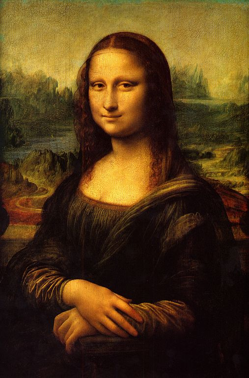

# AI-Artist

AI-Artist is a computer program that uses a variant of Genetic Algorithm to imitate a real artist. This program uses a given image and then tries to sketch it using just 2 methods. It can either place a colored dot on the canvas, or it can paint a rectangle of any color. 

The algorithm keeps trying to sketch it to perfection and will need to be stopped at some point as it aims to sketch a perfect replica which may take some time :)

## Screenshots

Obviously, when talking about paintings and artists, the first name that pops up in mind is Da Vinci and his remarkable masterpiece 

- Mona Lisa 

  Gebsadasdas
  
   

Following is a personal favorite painting. Fun Fact - There's even a hollywood movie which tells the story behind the painting.

- Girl with a Pearl Earring

Given Pearl Painting 

AI-Artist's attempt at it - 

## Support

For support and queries, email muhammadbassam73@gmail.com.

